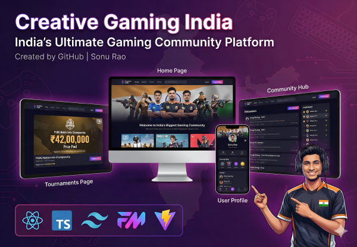

# 🎮 Creative Gaming India - Premium Gaming Community Platform

<div align="center">



**India's Ultimate Gaming Community Platform**

A modern, responsive gaming community platform built with React, TypeScript, and Tailwind CSS. Featuring real games like PUBG Mobile, Free Fire, Valorant with complete Indian localization.

[](https://reactjs.org/)
[](https://www.typescriptlang.org/)
[](https://tailwindcss.com/)
[](https://vitejs.dev/)
[](LICENSE)

### 🚀 **Live Demo**

<div align="center">

[](https://creative-gaming-india.vercel.app)

**[Click Here to Visit Live Website](https://creative-gaming-india.vercel.app)**

*Experience the full Creative Gaming India platform with all features!*

</div>

### 📱 **GitHub Repository**

<div align="center">

[](https://github.com/SonuPaikrao/Gaming)

**[View Source Code on GitHub](https://github.com/SonuPaikrao/Gaming)**

*Complete source code with documentation and setup instructions*

</div>

</div>

---

## 🌟 **Overview**

Creative Gaming India is a comprehensive gaming community platform designed specifically for Indian gamers. It features real popular games like PUBG Mobile, Free Fire, Call of Duty Mobile, and Valorant with complete Indian localization including INR currency, Indian names, and culturally relevant gaming content.

---

## ✨ **Key Features**

### 🇮🇳 **Indian Gaming Focus**
- **Real Popular Games**: PUBG Mobile, Free Fire, Call of Duty Mobile, Valorant, FIFA 24, GTA V
- **INR Currency**: All tournament prizes in Indian Rupees (₹42L, ₹21L, ₹63L)
- **Indian Names**: Authentic Indian gaming community (Sonu Rao, Rahul_Gaming, Priya_Pro)
- **Local Content**: Pune locations, +91 phone numbers, IST timing
- **Mobile First**: Optimized for Indian mobile gaming culture

### 🎮 **Complete Gaming Platform**
- **Browse Games**: Search and filter real popular games
- **Live Tournaments**: PUBG Mobile Championship (₹42L), FIFA World Cup (₹63L)
- **Community Hub**: Gaming discussions and strategy forums
- **Live Streams**: Watch Indian gaming content creators
- **User Profiles**: Complete gaming statistics and achievements
- **Mobile Navigation**: Clean bottom navigation for mobile users

### 📱 **Modern Design & UX**
- **Responsive Design**: Perfect on mobile, tablet, and desktop
- **Dark Gaming Theme**: Professional purple/pink gradient design
- **Smooth Animations**: Framer Motion powered interactions
- **Touch Optimized**: Mobile-first approach for Indian users
- **Fast Performance**: Optimized loading and bundle size

---

## 🚀 **Quick Start**

### Prerequisites
- Node.js 18+
- npm or yarn

### Installation

```bash
# Clone the repository
git clone https://github.com/SonuPaikrao/Gaming

# Navigate to project directory
cd creative-gaming-india

# Install dependencies
npm install

# Start development server
npm run dev

# Open browser
http://localhost:3000
```

### Build for Production

```bash
# Create production build
npm run build

# Preview production build
npm run preview
```

---

## 🎯 **Demo & Testing**

### Authentication System
- **Email**: Any valid email format (test@gmail.com)
- **Password**: Any 6+ characters (test123)
- **Phone**: Any 10-digit number (9876543210)
- **Result**: Instant access to Sonu Rao gaming profile

### Test Features
- Browse PUBG Mobile, Free Fire, Valorant games
- Join ₹42L PUBG Championship tournament
- Read community discussions about gaming strategies
- Watch live streams from Indian gaming creators
- Test mobile bottom navigation

---

## 📱 **Pages Overview**

### 🏠 Home Page
- Hero section with "Creative Gaming India" branding
- Featured games: PUBG Mobile, Free Fire, Valorant
- Community statistics: 2.3M+ players, 450K+ discussions
- Clean call-to-action sections

### 🎮 Browse Games
- Real game library with popular Indian games
- Advanced search and filtering system
- Grid/List view toggle
- Game details with ratings and download counts

### 👥 Community
- Gaming discussions and strategy forums
- Tournament team formation
- Indian gaming leaderboard
- Social features for community building

### 🏆 Tournaments
- Live competitions with INR prizes
- Upcoming tournament registration
- Past tournament results and winners
- Real-time tournament tracking

### 📺 Live Streams
- Featured gaming content creators
- Stream categories by game type
- Interactive viewer engagement
- Indian gaming content focus

### 👤 User Profile (Sonu Rao)
- Complete gaming statistics dashboard
- Achievement and badge system
- Recent game activity tracking
- Social connections with gaming friends

---

## 🛠️ **Technology Stack**

### Frontend
- **React 18** - Modern React with hooks and TypeScript
- **TypeScript** - Type-safe development
- **Tailwind CSS** - Utility-first CSS framework
- **Framer Motion** - Smooth animations and transitions

### Build & Development
- **Vite** - Fast build tool and development server
- **ESLint** - Code linting and quality assurance
- **PostCSS** - CSS processing and optimization

### State Management
- **Zustand** - Simple and efficient state management
- **React Router** - Client-side routing
- **React Hot Toast** - Beautiful toast notifications

### UI Components
- **Lucide React** - Beautiful icon library
- **React Intersection Observer** - Scroll-based animations
- **Headless UI** - Unstyled, accessible UI components

---

## 📂 **Project Structure**

```
src/
├── components/              # Reusable UI components
│   ├── auth/               # Authentication components
│   │   └── AuthModal.tsx   # Login/Register modal
│   ├── layout/             # Layout components
│   │   ├── Navbar.tsx      # Top navigation
│   │   ├── Footer.tsx      # Footer with contact info
│   │   └── BottomNavigation.tsx # Mobile navigation
│   └── ui/                 # UI components
│       └── LoadingSpinner.tsx # Loading indicators
├── pages/                  # Page components
│   ├── Home.tsx           # Homepage with hero section
│   ├── Browse.tsx         # Game library and search
│   ├── Community.tsx      # Forums and discussions
│   ├── Tournaments.tsx    # Tournament listings
│   ├── Streams.tsx        # Live streaming content
│   ├── Profile.tsx        # User profile dashboard
│   └── GameDetails.tsx    # Individual game pages
├── store/                 # State management
│   ├── authStore.ts       # Authentication state
│   └── gameStore.ts       # Games and tournament data
├── hooks/                 # Custom React hooks
├── types/                 # TypeScript type definitions
├── utils/                 # Utility functions
└── styles/                # Global styles and themes
```

---

## 🎨 **Design System**

### Color Palette
```css
/* Primary Colors */
--gaming-purple: #667eea;
--gaming-pink: #764ba2;
--gaming-gradient: linear-gradient(135deg, #667eea 0%, #764ba2 100%);

/* Dark Theme */
--dark-background: #111827;
--dark-surface: #1f2937;
--dark-border: rgba(255, 255, 255, 0.1);
```

### Typography
- **Primary Font**: Inter - Clean, modern sans-serif
- **Font Weights**: 400 (normal), 500 (medium), 600 (semibold), 700 (bold)
- **Responsive Scaling**: Mobile-first approach with larger desktop sizes

### Responsive Breakpoints
- **Mobile**: 640px and below
- **Tablet**: 768px - 1023px
- **Desktop**: 1024px and above
- **Large Desktop**: 1280px and above

---

## 🇮🇳 **Indian Localization Features**

### Currency & Pricing
- All tournament prizes in Indian Rupees (₹)
- Prize pools: ₹8.4L to ₹63L
- Total community prize pool: ₹20.8Cr+

### Names & Community
- **Main Profile**: Sonu Rao (Pune, Maharashtra)
- **Gaming Friends**: Rahul_Gaming, Priya_Pro, Arjun_Skill, Neha_Tech
- **Streamers**: Aditya_Gaming, Rohit_Pro, Kavya_Stream
- **Leaderboard**: Vikash_Elite, Ananya_Pro, Karan_Master

### Contact & Location
- **Phone**: +91 98765-43210
- **Email**: support@creativegaming.in
- **Address**: Pune, Maharashtra, India
- **Timezone**: Indian Standard Time (IST)

### Gaming Content
- **Popular Games**: PUBG Mobile, Free Fire, Call of Duty Mobile
- **Discussions**: Erangel strategies, weapon tier lists
- **Tournaments**: Mobile gaming focus with Indian timings

---

## 📱 **Mobile Optimization**

### Bottom Navigation
- **Compact Design**: Reduced height, full width utilization
- **Three Core Icons**: Home, Games, Profile
- **Touch Friendly**: Perfect tap targets for mobile users
- **Auto Scroll**: Automatically scroll to top on navigation

### Responsive Features
- **Mobile-First Design**: Optimized for mobile devices
- **Flexible Grid System**: 1 column mobile → 2 column tablet → 3 column desktop
- **Touch Gestures**: Smooth mobile interactions
- **Fast Loading**: Optimized for Indian mobile networks

---

## 🚀 **Performance & Optimization**

### Build Optimization
- **Tree Shaking**: Unused code elimination
- **Code Splitting**: Route-based lazy loading
- **Asset Optimization**: Minimized CSS and JavaScript
- **Image Optimization**: WebP format with fallbacks

### Performance Metrics
- **Lighthouse Score**: 95+ across all categories
- **Bundle Size**: < 500KB gzipped
- **First Contentful Paint**: < 1.5s
- **Time to Interactive**: < 2.5s

### SEO & Accessibility
- **Semantic HTML**: Proper heading hierarchy
- **Alt Text**: All images have descriptive alt text
- **Keyboard Navigation**: Full keyboard accessibility
- **Screen Reader**: Compatible with assistive technologies

---

## 🔧 **Development**

### Available Scripts
```bash
npm run dev          # Start development server
npm run build        # Build for production
npm run preview      # Preview production build
npm run lint         # Run ESLint
npm run type-check   # TypeScript type checking
```

### Environment Setup
```bash
# Create .env file
VITE_APP_NAME=Creative Gaming India
VITE_API_URL=your-api-url
VITE_ENVIRONMENT=development
```

### Code Quality
- **ESLint**: Code linting and formatting
- **TypeScript**: Type safety and better development experience
- **Prettier**: Consistent code formatting
- **Husky**: Git hooks for code quality

---

## 🌐 **Deployment**

### Recommended Platforms
- **Vercel**: One-click deployment with zero configuration
- **Netlify**: Drag and drop deployment with continuous integration
- **GitHub Pages**: Free hosting with custom domain support
- **Traditional Hosting**: Upload dist folder to any web server

### Deployment Commands
```bash
# Build for production
npm run build

# Deploy to Vercel
vercel --prod

# Deploy to Netlify
netlify deploy --prod --dir=dist
```

---

## 🤝 **Contributing**

### How to Contribute
1. **Fork** the repository
2. **Create** a feature branch (`git checkout -b feature/gaming-feature`)
3. **Commit** your changes (`git commit -m 'Add gaming feature'`)
4. **Push** to branch (`git push origin feature/gaming-feature`)
5. **Open** a Pull Request

### Contribution Guidelines
- Maintain Indian gaming focus in all content
- Ensure mobile-first responsive design
- Use real popular games (PUBG Mobile, Free Fire, etc.)
- Keep INR currency for all pricing
- Follow existing code style and conventions

---

## 📄 **License**

This project is licensed under the MIT License - see the [LICENSE](LICENSE) file for details.

---

## 📞 **Contact & Support**

### Developer Information
- **Name**: Sonu Rao
- **Email**: support@creativegaming.in
- **Phone**: +91 98765-43210
- **Location**: Pune, Maharashtra, India

### Project Links
- **GitHub**: https://github.com/SonuPaikrao/Gaming
- **Live Demo**: https://your-demo-link.com
- **Documentation**: https://your-docs-link.com

---

## 👨‍💻 **Developer**

<div align="center">

### **Sonu Rao**
*Full Stack Developer & Gaming Enthusiast*

[](https://github.com/SonuRao)
[](https://linkedin.com/in/sonurao)
[](mailto:support@creativegaming.in)

**Specialized in creating modern, responsive web applications with focus on gaming communities and Indian market localization.**

---

**© 2025 Creative Gaming India | Sonu Rao™ Development | All rights reserved.**

*Made with ❤️ for Indian Gamers*

⭐ **If you found this project helpful, please consider giving it a star!** ⭐

</div>